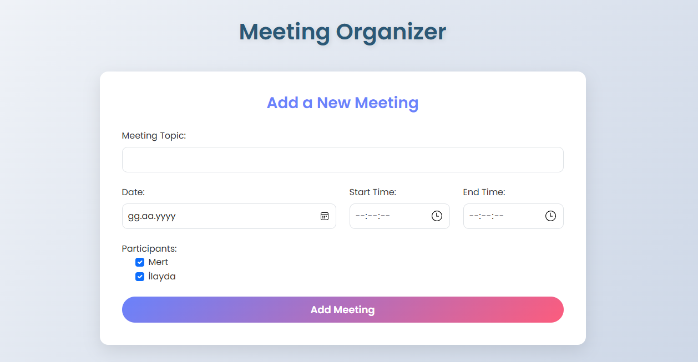
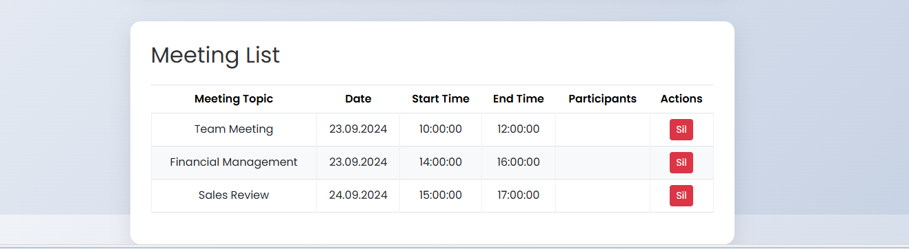

# MeetingOrganizer

MeetingOrganizer is an application developed for managing meetings. The server side is built using .NET with a layered architecture, utilizing Data Transfer Objects (DTOs) to communicate with a RESTful API. The frontend is developed using HTML and JavaScript.




## Features

- Add, list, and delete meetings via the API
- Dynamic loading of participants
- Simple and user-friendly interface

## Technologies Used

- **Backend**: .NET
- **Frontend**: HTML, JavaScript
- **Architecture**: Layered architecture with DTO usage
- **API**: RESTful API for meeting management

## Installation

1. Clone the repository:
   ```bash
   git clone https://github.com/1mertyuksel/MeetingOrganizer.git
